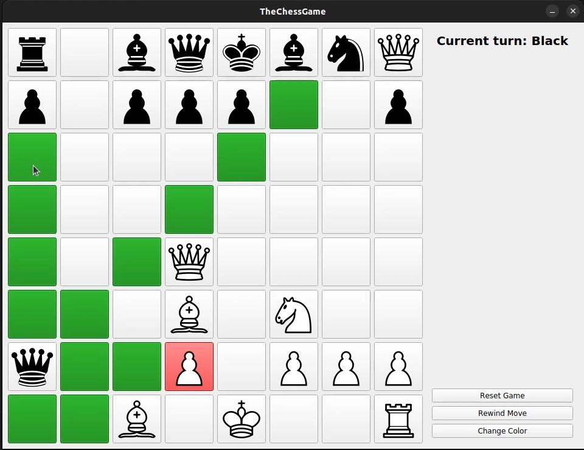

# Chess - A Qt-based Chess Game

## Demo Video

You can watch the demo video of the game by clicking the image below:

[](https://www.youtube.com/watch?v=vasLyqTEhRs)

## Pre-compiled Binaries

You can get the pre-compiled binaries from the releases page.

## Compilation Instructions

To compile the project, you need to have `qt5` along with `qmake` and `qtsvg` packages installed. This game mainly developed on Linux, so the compilation instructions are for Linux. But I'll show you how to compile it for Windows from Linux as well.

### Linux

For Linux, you can compile the project by running the following commands:

```bash
qmake
make
```

That's it! You can run the game by executing the `./build/Chess` binary.

### Compile Statically for Windows via Docker Container

Feeling brave? You can compile the project for Windows from Linux by using the `mxe` Docker container. First, you need to have Docker installed on your system. Then, open a terminal in the project directory and run the following command:

```bash
docker run -it -v $(pwd):/app syping/qt5-static-mingw bash -c "cd /app && export QT_SELECT=qt5-x86_64-w64-mingw32 && qmake -qt=qt5-x86_64-w64-mingw32 && make clean && make && ls -lah build/Chess.exe"
```

Example output:

```bash
sarp@IdeaPad:~/Documents/GitHub/OOP_Group8/Chess$ docker run -it -v $(pwd):/app syping/qt5-static-mingw bash -c "cd /app && export QT_SELECT=qt5-x86_64-w64-mingw32 && qmake -qt=qt5-x86_64-w64-mingw32 && make clean && make && ls -lah build/Chess.exe"
Info: creating stash file /app/.qmake.stash
make -f Makefile.Release clean
make[1]: Entering directory '/app'
rm -f build/rcc/qrc_resources.cpp
[...]
make[1]: Leaving directory '/app'
make -f Makefile.Release
make[1]: Entering directory '/app'
x86_64-w64-mingw32-g++ -c -pipe -fno-keep-inline-dllexport -O2 -Wall -W -Wextra -fexceptions -mthreads -DUNICODE -D_UNICODE -DWIN32 -DQT_NO_DEBUG -DQT_SVG_LIB -DQT_WIDGETS_LIB -DQT_GUI_LIB -DQT_CORE_LIB -DQT_NEEDS_QMAIN -I. -Iinclude -I/opt/windev/qt64s_5.9.9/include -I/opt/windev/qt64s_5.9.9/include/QtSvg -I/opt/windev/qt64s_5.9.9/include/QtWidgets -I/opt/windev/qt64s_5.9.9/include/QtGui -I/opt/windev/qt64s_5.9.9/include/QtCore -Ibuild/moc -I/opt/windev/qt64s_5.9.9/mkspecs/win32-g++  -o build/obj/Bishop.o src/Bishop.cpp
x86_64-w64-mingw32-g++ -c -pipe -fno-keep-inline-dllexport -O2 -Wall -W -Wextra -fexceptions -mthreads -DUNICODE -D_UNICODE -DWIN32 -DQT_NO_DEBUG -DQT_SVG_LIB -DQT_WIDGETS_LIB -DQT_GUI_LIB -DQT_CORE_LIB -DQT_NEEDS_QMAIN -I. -Iinclude -I/opt/windev/qt64s_5.9.9/include -I/opt/windev/qt64s_5.9.9/include/QtSvg -I/opt/windev/qt64s_5.9.9/include/QtWidgets -I/opt/windev/qt64s_5.9.9/include/QtGui -I/opt/windev/qt64s_5.9.9/include/QtCore -Ibuild/moc -I/opt/windev/qt64s_5.9.9/mkspecs/win32-g++  -o build/obj/GameBoard.o src/GameBoard.cpp
[...]
make[1]: Leaving directory '/app'
-rwxr-xr-x 1 root root 17M Dec 14 20:12 build/Chess.exe
```

### Compile Statically for Linux via Docker Container

You can also compile the project for Linux from Linux by using the `fishwaldo/qt-staticbuilds` Docker container. First, you need to have Docker installed on your system. Then, open a terminal in the project directory and run the following command:

```bash
docker run -it -v $(pwd):/app fishwaldo/qt-staticbuilds:5.12.4 bash -c "cd /app && rm -f .qmake.stash && /opt/Qt/5.12.4/bin/qmake && make clean && make && ls -lah build/Chess"
```

Example output:

```bash
sarp@IdeaPad:~/Documents/GitHub/OOP_Group8/Chess$ docker run -it -v $(pwd):/app fishwaldo/qt-staticbuilds:5.12.4 bash -c "cd /app && rm -f .qmake.stash && /opt/Qt/5.12.4/bin/qmake && make clean && make && ls -lah build/Chess"
[...]
-rwxr-xr-x 1 root root 14M Dec 23 21:40 build/Chess
```

### Deployment with Dynamic Linking on Windows

First, to create the project's build configuration:

```powershell
qmake game.pro
```

After, to be able to compile:

```powershell
mingw32-make
```

Now, it is necessary to transfer all dependencies to the directory where your .exe file is located
using the `windeployqt` command. Assuming that Qt is installed in C:\Qt\6.8.0\mingw_64\bin,
you should first navigate to that directory:

```powershell
cd C:\Qt\6.8.0\mingw_64\bin
```

Finally, let's assume that the project's .exe file is located at
`C:\ProjectQt\OOP_Group8\Chess\build\Desktop_Qt_6_8_0_MinGW_64_bit-Debug\build\Chess.exe`
You can copy the necessary dependencies with this command:

```powershell
"C:\Qt\6.8.0\mingw_64\bin\windeployqt.exe" "C:\ProjectQt\OOP_Group8\Chess\build\Desktop_Qt_6_8_0_MinGW_64_bit-Debug\build\Chess.exe"
```